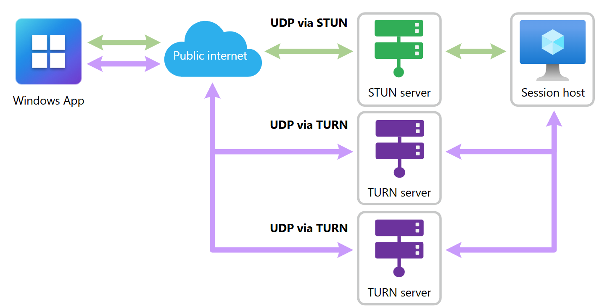

---
# Required metadata
# For more information, see https://learn.microsoft.com/en-us/help/platform/learn-editor-add-metadata
# For valid values of ms.service, ms.prod, and ms.topic, see https://learn.microsoft.com/en-us/help/platform/metadata-taxonomies

title: Use RDP Multipath with Windows 365
description: Learn how to use RDP Multipath Windows 365 Cloud PCs.
author:      ridalwan # GitHub alias
ms.author:   rinku.dalwani # Microsoft alias
ms.service:  Windows365
# ms.prod:   # To use ms.prod, uncomment it and delete ms.service
ms.topic:    How-to
ms.date:     07/10/2025
---

# Use RDP Multipath with Windows 365

## Overview

Remote Desktop Protocol (RDP) Multipath enhances the reliability and performance of connection to Windows 365 Cloud PCs by intelligently managing multiple network paths. This feature delivers smooth user experience even in environments with variable network conditions.

RDP Multipath extends RDP Shortpath and uses Interactive Connectivity Establishment (ICE) to dynamically identify and choose the most reliable transport path in real time.

> [!IMPORTANT]
> __RDP Multipath is now Generally Available (GA).__ We are actively rolling out this feature to production in phases, with an increasing percentage of connections benefiting from RDP Multipath as deployment progresses. During this period, not all connections use RDP Multipath immediately. Our commitment to quality guides each phase, ensuring a stable and reliable experience for all users as progress toward full availability.

### RDP Multipath Benefits

- __Seamless integration__: No configuration changes are needed beyond ensuring your environment supports [RDP Shortpath](/windows-365/enterprise/rdp-shortpath-public-networks).

- __Intelligent path management__: ICE discovers and evaluates multiple Remote Desktop Protocol (RDP) Shortpath routes using User Datagram Protocol (UDP) over STUN (Simple Traversal Underneath NAT) and TURN (Traversal Using Relays around NAT) protocols.

- __Enhanced reliability__: Backup paths remain on standby. If the active path becomes unstable or fails, RDP Multipath automatically switches to the next best path, reducing session drops and interruptions.

> [!IMPORTANT]
> If all paths fail example due to a local network outage, the system attempts to reconnect once connectivity is restored.

### How does this work?

RDP Multipath uses multiple network paths, discovered with Interactive Connectivity Establishment (ICE), to improve connection reliability. These paths can include combinations like UDP over STUN or UDP over Relay. If the main connection fails, the system automatically switches to a backup path. If all paths are lost—such as during a network outage—the system tries to reconnect once the network is available again. 

> [!NOTE]
> This version of Multipath does not support users who connect exclusively through WebSocket (TCP-based).

  
Here is an example of a setup that might use UDP via STUN as the main path, with two backup UDP connections through a TURN server..  



### Requirements

- __Enable RDP Shortpath for public networks:__ To enable RDP Shortpath for public networks, visit the following page and follow the instructions - [Enable RDP Shortpath for public networks](/azure/virtual-desktop/rdp-shortpath?tabs=public-networks).

- __Client Version__: Requires the latest version of the Remote Desktop client (MSRDC) or Windows App, starting from the January 2025 release (version 1.2.6074 or later)..

### Verify RDP Multipath connectivity

Users can check the connection status of a remote session from the connection bar, which shows RDP Multipath is enabled, as shown in the following example screenshot:


### Manage RDP Multipath Availability

RDP Multipath is rolling out in phases.   
If you experience issues and want to turn it off temporarily—or if you want to try it early—you can manually enable or disable it on your session hosts using the following registry key:

#### To enable RDP Multipath early (opt in):

To enable RDP Multipath manually, run the following command in an elevated Command Prompt to set the registry key value to 100:

```bash
reg add "HKLM\SYSTEM\CurrentControlSet\Control\Terminal Server\RdpCloudStackSettings" /v SmilesV3ActivationThreshold /t REG_DWORD /d 100 /f
```

#### To disable RDP Multipath early (opt out):

To disable RDP Multipath manually, run the following command in an elevated Command Prompt to set the registry key value to 0:

```bash
reg add "HKLM\SYSTEM\CurrentControlSet\Control\Terminal Server\RdpCloudStackSettings" /v SmilesV3ActivationThreshold /t REG_DWORD /d 0 /f
```

> [!NOTE]
> After updating the registry key, users must disconnect and reconnect to the session host for their Windows 365 Cloud PC for the change to take effec.

### 

