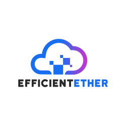
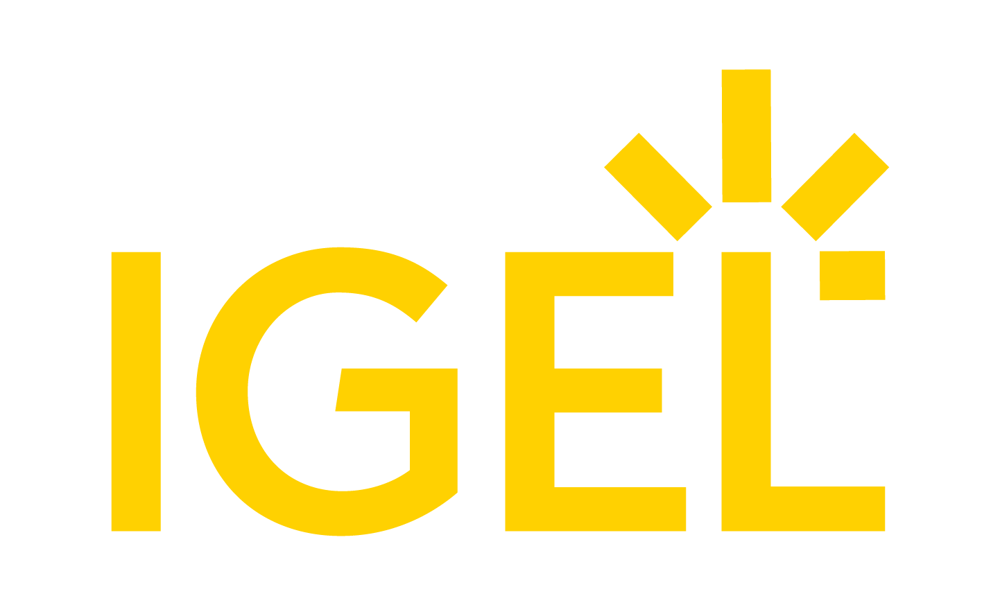
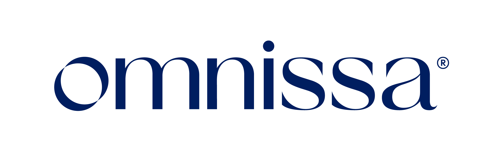

---
# required metadata
title: Windows 365 partners
titleSuffix:
description: Learn about the partners whose products have documented compatibility with Windows 365.
keywords:
author: mmeggmegan  
ms.author: mmegg
manager: jofederi
ms.date: 04/24/2026
ms.topic: overview
ms.service: windows-365
ms.subservice:
ms.localizationpriority: high
ms.assetid: 

# optional metadata

#ROBOTS:
#audience:

ms.reviewer: mmegg
ms.suite: ems
search.appverid: MET150
#ms.tgt_pltfrm:
ms.custom: intune-azure; get-started
ms.collection:
- M365-identity-device-management
- tier2
---

# Windows 365 partners

Windows 365 is a cloud-native Windows platform that delivers Cloud PCs through the Microsoft Cloud. Alongside its native capabilities, Windows 365 is supported by an ecosystem of technology partners whose solutions extend or complement the platform for specialized or complex scenarios.

The partners listed on this page are independent software vendors (ISVs) and hardware vendors whose products have documented compatibility with Windows 365.

Use this page to explore technology solutions that work alongside Windows 365 and identify options that fit your deployment needs. Partners are listed alphabetically. 

What this page does not include: This page does not include system integrators, deployment partners, managed service providers (MSPs), or resellers. To find a partner who can help you plan, deploy, or manage a Windows 365 environment, visit the Microsoft Partner Finder.

Citrix

|  | [Citrix](https://www.citrix.com/global-partners/microsoft/windows-365.html) delivers Windows 365 Cloud PCs through Citrix DaaS using the cutting-edge Citrix HDX connection technology, a set of remoting and optimization capabilities that adapts to network conditions and improves audio, video, and real-time communications (for example, Microsoft Teams) so sessions stay responsive on challenging networks. Windows 365 provisions the Cloud PCs and manages their lifecycle. Citrix adds the delivery layer and session policies, with optional configuration and tuning where deployed.  |
|---|---|
| **Solutions or products** | Citrix DaaS integration for Windows 365 enables users to launch Windows 365 Cloud PCs from Citrix Workspace and connect using Citrix HDX. |
| **Best for** | - Organizations already standardized on Citrix DaaS that want Windows 365 Cloud PCs delivered through the same user access point. - Teams that want Citrix policies and optional tuning for Windows 365 sessions while keeping Cloud PC provisioning and lifecycle in Windows 365 and Intune. |
| **Windows 365 integration** | Provides a Citrix access and delivery layer for Windows 365 Cloud PCs through Citrix DaaS, using Citrix HDX for session connectivity. |
| **Who it’s for** | Citrix administrators, end user computing (EUC) and virtual desktop teams, and IT admins operating Citrix DaaS alongside Windows 365 and Microsoft Intune. |
| **Resources** | - [Windows 365 partner integration scenarios](https://learn.microsoft.com/en-us/windows-365/enterprise/partner-integration-scenarios) - [Set up Citrix HDX Plus for Windows 365 Enterprise](https://learn.microsoft.com/en-us/windows-365/enterprise/set-up-citrix) |
| **Contact** | **Sales:** https://www.citrix.com/global-partners/microsoft/windows-365.html  |

ControlUp

| **Overview** | [ControlUp](https://www.controlup.com) helps IT teams identify and fix end-user experience and performance issues across Windows 365 Cloud PCs (and can also support Azure Virtual Desktop) by providing real-time visibility and troubleshooting across the Cloud PC, endpoint device, and connection path. |
|---|---|
| **Solutions or products** | ControlUp provides digital employee experience monitoring, troubleshooting, automation, and remediation for Windows 365 (and can also support Azure Virtual Desktop), including Windows 365-specific monitoring and telemetry to help IT teams proactively detect and resolve issues and improve the end-user experience. |
| **Best for** | - Organizations operating Windows 365 at scale and need proactive monitoring, troubleshooting, and automated remediation to reduce support burden. - Organizations needing visibility into where experience issues originate (Cloud PC vs. endpoint device vs. connection) to speed root-cause analysis. |
| **Windows 365 integration** | Adds deeper operational visibility, experience monitoring, and remediation and automation beyond built-in administration experiences to help teams run Cloud PCs more reliably. |
| **Who it’s for** | EUC and virtual desktop administrators, IT operations and service desk teams, and digital workplace owners. |
| **Resources** | ControlUp press release: https://www.controlup.com/press/controlup-enhances-support-for-windows-365/ YouTube video: https://www.youtube.com/watch?v=7IK288BMapY |
| **Contact** | **Sales:** Microsoft@Controlup.com  **Support:** [Controlup.com/Microsoft](https://www.controlup.com/Microsoft)  **Marketplace:** [ControlUp ONE](https://marketplace.microsoft.com/en-us/product/controluptechnologies1659551284318.controlup_dex?OCID=AIDcmmm9t2wfa3_SEM__k_CjwKCAjw-dfOBhAjEiwAq0RwIwdKRx_VE6HNfYnO8G1LywMUQb1Zgd9OZ70hFVEAStcEQZGiZOoEYhoC10oQAvD_BwE_k_&tab=Overview) |

EfficientEther

|  | [EfficientEther](https://www.efficientether.co.uk/) helps organizations plan, optimize, deploy, and manage Windows 365 Cloud PCs through enhanced visibility, governance, AI‑driven analysis, automation, and application readiness. Its solutions provide intelligent insights for cost optimization, migration planning, operational improvement, and service delivery, while reducing deployment blockers through modern application packaging and readiness workflows. |
|---|---|
| **Solutions or products** | **EtherInsights** – Provides unified visibility, governance, and cost optimization across Microsoft 365, Azure, and Windows 365. Capabilities include Cloud PC monitoring, reporting, migration planning, setup guidance, wizard-based configuration workflows, assistant-driven analysis, and operational actions. Built-in intelligence supports recommendations and improved service delivery.  **EtherAssist** – Delivers AI-driven IT operations and automation with workflow, ITSM, and compliance support. Helps teams streamline troubleshooting, reduce escalations, and maintain consistent operational governance.  **EtherApps Forge** – Provides application assessment, capture, and packaging modernization for Windows 365 environments. MSIX packaging is a core focus, with support for App Attach and additional output formats such as MSI and IntuneWin. This helps organizations reduce application readiness blockers and accelerate migrations to modern Windows and Cloud PC environments. |
| **Best for** | - Organizations seeking to optimize Microsoft cloud desktop operations, improve governance, or migrate from legacy virtual desktop environments to Windows 365 Cloud PCs. - MSPs and IT services teams needing unified reporting, repeatable automation, and scalable Cloud PC deployment and management across one or more tenants. |
| **Windows 365 integration** | EfficientEther supports planning, migration, deployment, and ongoing management for Windows 365 environments. It provides Cloud PC visibility, setup and configuration support, intelligent analysis, operational actions, governance, automation, and TCO-based planning. It also supports migration scenarios from Azure Virtual Desktop and other legacy desktop environments, enabling full Cloud PC lifecycle delivery from build through ongoing management. |
| **Who it's for** | End-user computing and virtual desktop administrators, IT operations and helpdesk teams, MSPs, security and compliance stakeholders, and FinOps or cloud optimization teams. |
| **Resources** | [Use Cases - EtherAssist](https://docs.etherassist.ai/) [Windows 365 / Cloud PC Documentation](https://docs.etherinsights.ai/getting-started/cloud-pc) [EtherInsights Documentation](https://docs.etherinsights.ai/) [EtherAssist Documentation](https://docs.etherassist.ai/) [EtherApps Forge Documentation](https://www.etherapps.ai) |
| **Contact** | **Sales:** sales@efficientether.co.uk **Support:** support@efficientether.co.uk **Marketplace listings:** [EtherInsights](https://marketplace.microsoft.com/en-us/product/efficientetherltd1689768231927.etherinsights_prod_per_user?tab=Overview), [EtherAssist](https://marketplace.microsoft.com/en-us/product/WA200008520?tab=Overview) |

Hydra by Login VSI

|  | [Hydra by Login VSI](https://www.loginvsi.com/) is the operational control plane for Windows 365, giving enterprise IT teams and MSPs the provisioning speed, cost control, and lifecycle management that native capabilities alone don't deliver using the operational patterns they already know from managing VDI. Built by Login VSI, with 15+ years in enterprise EUC environments worldwide. |
|---|---|
| **Solutions or products** | Hydra gives enterprise IT teams and MSPs full operational control over Windows 365, including: rapid Cloud PC provisioning (hours to minutes), cost and license optimization based on actual usage data, unified lifecycle and image management, and agent-based real-time session visibility all from a single control plane with built-in multi-tenancy and enterprise-grade RBAC. |
| **Best for** | - Enterprise IT and EUC teams running Windows 365 at scale looking to reduce operational overhead, eliminate unnecessary Cloud PC spend, and manage their entire environment from a single, unified console. - MSPs that need multi-tenant Cloud PC management with strict tenant isolation and RBAC at no extra cost. |
| **Windows 365 integration** | Hydra centralizes Windows 365 operations across the full Cloud PC lifecycle by connecting Intune, Entra, M365, and Azure Image Gallery into a single console built on the familiar workflows VDI administrators already know. Teams handle provisioning, license right-sizing, image management, and live session diagnostics without portal hopping, dramatically reducing time spent on daily operations and making cloud modernization seamless, with no retraining required. |
| **Who it's for** | Enterprise EUC and virtual desktop administrators, IT teams managing Windows 365 at scale, and MSPs running multi-tenant Cloud PC environments. |
| **Resources** | [Hydra for AVD and Windows 365 Management](https://www.loginvsi.com/platform/hydra/) |
| **Contact** |  **Sales:** https://www.loginvsi.com/platform/hydra/#get-demo  **Support:** https://www.loginvsi.com/contact/ **Marketplace listing:** [View listing](https://marketplace.microsoft.com/en-us/product/azure-applications/itprocloudgmbh1628775137215.hydra-deploy-d1?tab=overview?utm_campaign=13669533-25Q2%20-%20Hydra%20for%20AVD%20Launch) |

IGEL

|  | Securely access Windows 365 and Azure Virtual Desktop from any endpoint. [IGEL](https://www.igel.com/) helps organizations modernize endpoint experiences by enabling secure, high-performance access to Windows 365 Cloud PCs and Azure Virtual Desktop across a wide range of devices and provides a secure endpoint operating system and device management platform optimized for cloud workspaces, including Windows 365. It enables organizations to deliver consistent, secure access to Cloud PCs across a wide range of endpoint devices while simplifying endpoint management and reducing total cost of ownership. |
|---|---|
| **Solutions or products** | **IGEL OS** – A secure, read-only endpoint operating system that reduces attack surface, supports Zero Trust principles, and enables optimized access to Windows 365 Cloud PCs and Azure Virtual Desktop.  **IGEL Universal Management Suite (UMS)** – Centralized management for endpoint provisioning, configuration, policy enforcement, software updates, and lifecycle management at scale.  **IGEL Cloud Gateway** – Extends secure endpoint connectivity and management beyond the corporate network, supporting distributed, remote, and hybrid work environments. |
| **Best for** | - Organizations seeking to strengthen endpoint security while delivering optimized Windows 365 and Azure Virtual Desktop experiences.  - Enterprises looking to repurpose existing hardware, reduce device replacement costs, and extend endpoint lifecycles. |
| **Windows 365 integration** | IGEL delivers secure, high-performance access to Windows 365 Cloud PCs and Azure Virtual Desktop from a wide range of endpoint devices. By combining a purpose-built endpoint OS with centralized management, IGEL helps organizations provide a consistent user experience, simplify operations, and support cloud-managed desktop strategies. |
| **Who it's for** | End-user computing teams, IT administrators, security teams, and organizations managing distributed or hybrid workforces using Windows 365. |
| **Resources** | For more information, visit the [IGEL website](https://www.igel.com/windows365/) |

Nerdio

|  | [Nerdio](https://getnerdio.com/) delivers automation, cost optimization, and management solutions for Windows 365 and Azure Virtual Desktop. Its platform helps organizations simplify deployment, streamline ongoing management, and optimize cloud resource usage. |
|---|---|
| **Solutions or products** | **Nerdio Manager for Enterprise** – Provides centralized management, automation, and optimization for Windows 365 and AVD environments.  **Nerdio Manager for MSP** – Enables MSPs to deploy, manage, and optimize multiple customer environments at scale.  **Cost Optimization Engine** – Delivers insights and automation to reduce Azure and Cloud PC-related costs. |
| **Best for** | - Organizations looking to automate and optimize Windows 365 environments. - MSPs delivering Cloud PC services across multiple tenants. |
| **Windows 365 integration** | Nerdio integrates with Windows 365 by providing automation, policy-based management, and cost optimization capabilities. It helps reduce operational overhead and improve efficiency across Cloud PC deployments. |
| **Who it's for** | IT teams, cloud administrators, MSPs, and organizations wanting to modernize and are focused on cost optimization and automation. |
| **Resources** | - [Microsoft partner case study](https://partner.microsoft.com/en-us/case-studies/nerdio)   - [Nerdio customer story](https://getnerdio.com/customer-story/nerdio-manager-for-enterprise-case-study-3cloud/) |
| **Contact** | **Sales:** https://getnerdio.com/contact-us/ |

Omnissa

|  | [Omnissa](https://www.omnissa.com/) Horizon integrates with Windows 365 to provide simplified hybrid cloud desktop and app support, enhanced employee experience, and reduced costs with modern application management.  |
|---|---|
| **Solutions or products** | - Deploy Windows 365 alongside Horizon 8 and Horizon Cloud for on-premises and multi-cloud support.  - Improve user experience across all desktops with Blast Extreme protocol.   - Enable broad device choice and peripheral support with Horizon Client.   - Reduce app management costs and time using App Volumes with Apps on Demand.   - Maintain high security standards with remote experience, user, and endpoint policy controls. |
| **Best for** | - Organizations using Windows 365 that want to take advantage of hybrid desktop and app delivery with Horizon and App Volumes.  - Organizations using Horizon that want to manage and deliver Windows 365 Cloud PCs through the Horizon console. - Organizations using Horizon who want to use the familiar Horizon Client and Blast Extreme protocol to access desktops across Horizon and Windows 365. |
| **Windows 365 integration** | Helps organizations offer their employees access to Windows 365 Cloud PCs from Horizon environments, with additional hybrid delivery, app management, and experience benefits. |
| **Who it's for** | End user computing and virtual desktop teams and IT admins operating Horizon environments alongside Windows 365. |
| **Resources** | [Omnissa blog: Announcing general availability of Omnissa Horizon with Windows 365](https://www.omnissa.com/insights/blog/announcing-general-availability-omnissa-horizon-with-windows-365/) [YouTube video](https://www.youtube.com/watch?v=ZBLPlrgcK7g) |
| **Contact** | **Sales:** [Omnissa sales contact page or general inquiry](https://www.omnissa.com/contact-us/) **Support:** [Omnissa Support](https://www.omnissa.com/support/) **Marketplace listing:** https://marketplace.microsoft.com/en-us/product/omnissallc.omnissa-solutions |

WorkspaceDNA

|  | [WorkspaceDNA](https://www.workspacedna.com/) provides application discovery, testing, and remediation solutions to support migrations to Windows 365. It enables organizations to assess application readiness, identify compatibility issues, and accelerate deployment timelines. |
|---|---|
| **Solutions or products** | WorkspaceDNA automates the complete application lifecycle from migration to continuous operations — giving enterprises the data intelligence to validate, patch, and deploy Windows applications at scale without the manual overhead that stalls Windows 365 and Intune rollouts. |
| **Best for** | - Organizations migrating complex application portfolios to Windows 365. - IT teams focused on reducing application compatibility risks during deployment. |
| **Windows 365 integration** | WorkspaceDNA supports Windows 365 migrations by providing application assessment, automated testing, and remediation insights. It helps organizations ensure application compatibility and accelerate readiness for Cloud PC deployment. |
| **Who it's for** | Application owners, EUC teams, IT administrators, and organizations managing large or complex application estates. |
| **Contact** | **Support:** https://learn.rimo3.com/knowledge-base **Marketplace listing:** [View listing](https://marketplace.microsoft.com/en-us/product/rimo3.rimo3cloudtransact) |

## Additional Microsoft resources

- [Microsoft App Assure](https://aka.ms/AppAssure) – Assistance for eligible customers experiencing application compatibility issues when adopting Windows 365 and other Microsoft technologies.

## Interested in being added to this list?

Reach out to us at WindowsCloudHello@Microsoft.com if you’d like to be considered for inclusion.

## Next steps

[Learn more about Windows 365](overview.md)
